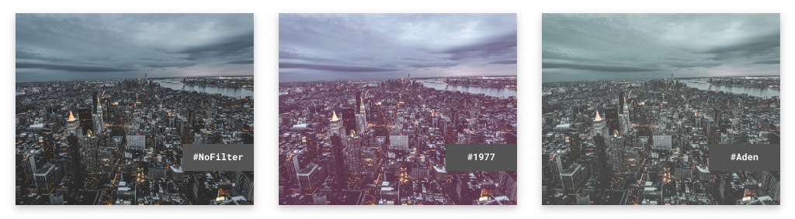
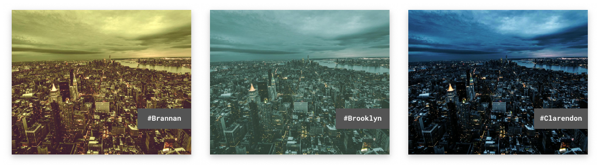
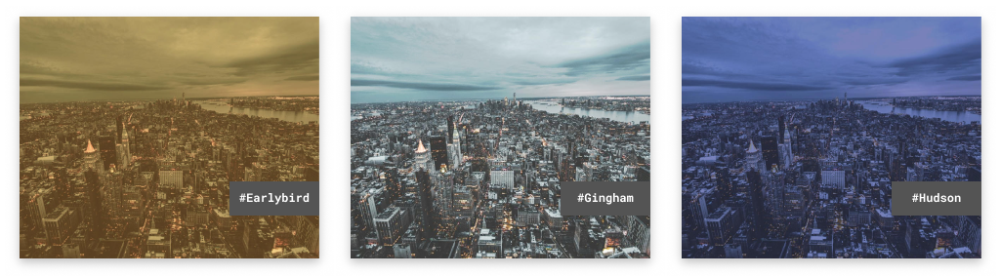
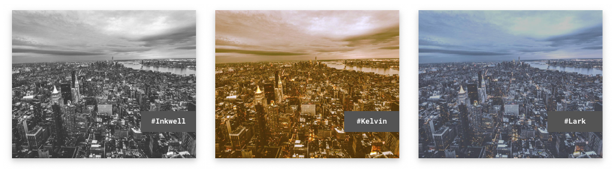
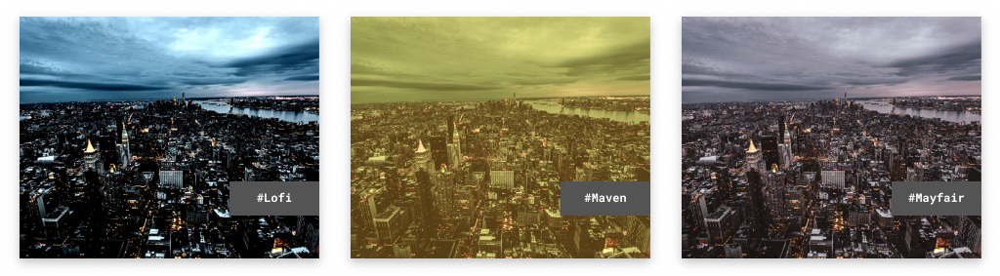
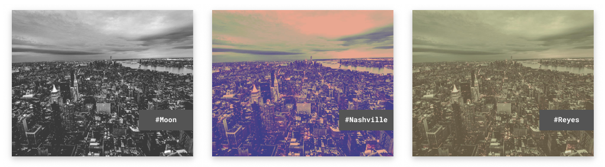
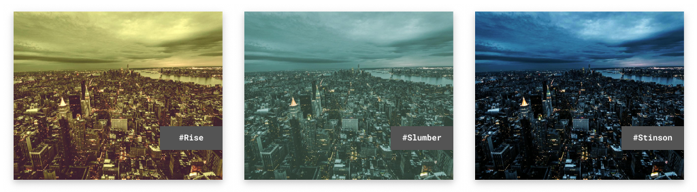
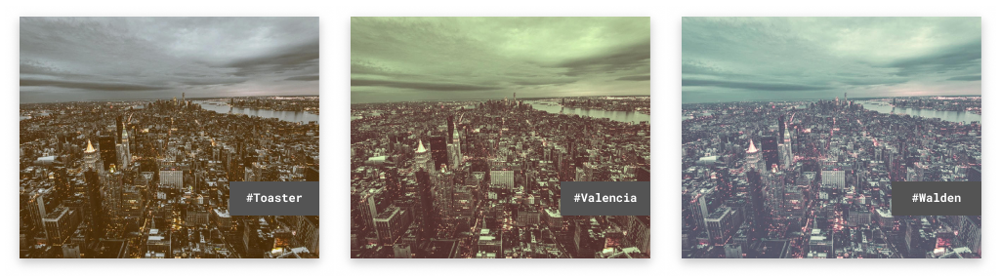

这个 repo 利用 rust image lib 来操作 image, 获取每个像素点,然后遍历像素点进行mutation, 或者生成一个新的ImageBuffer, 然后操作ImageBuffer
来生成最终的Image. 可以通过这个库来窥视出 Image 操作的方式, 里边的公式需要搜索理解. 还有就是通过这个库窥探到
ps那些混合模式的数学公式. 

* wrapping_mul, 所有以 wrapping 开头的操作都不会造成类型计算溢出, 会在对应位置截断


# Rustagram
[](https://travis-ci.org/ha-shine/rustagram)

Rustagram is a toy implementation of instgram-ish filters in Rust for fun and profit. 
Well no profit, but fun nonetheless.

## Usage

- ```cargo install rustagram```
- ```rustagram input.jpg 1977```

## Filters










## Credits
- [CSSgram](https://github.com/una/CSSgram) by [una](https://github.com/una) for inspiration 👩‍🎨
- [Alex Jodin](https://unsplash.com/@ajshotz) from unsplash for the photo which can be found [here](https://unsplash.com/photos/F0bx43QKhRA) 📸